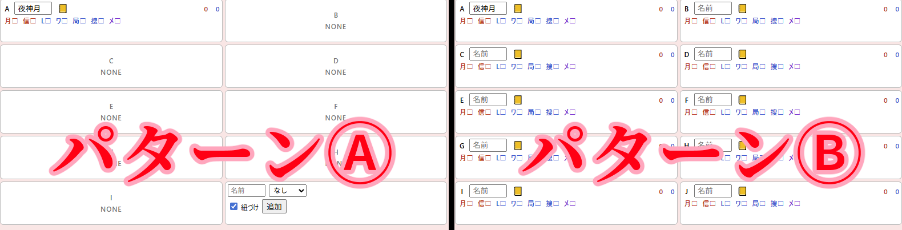

# DEATH NOTE Killer Within用Webメモアプリ（局長メモ）　readme
# 作者  
作者（アイコン描きやreadme書きはやったけどコードの全てはGPTに指示を出しただけ）…紅茶即乱（X:[@teasokuran](https://x.com/teasokuran)）  
神！…ChatGPT5  
  
---
  
# 更新履歴  
-V1.0（2025-8-20ぐらい）  
　自分用に作っていたやつ。公開はしてないしデータも残ってない。  
-V1.1（2025-8-26）  
 　公開用にV1.1から様々な修正をしたもの。  
-V1.2（2025-9-4）  
 　Xキラ、Nへ対応。名前欄を残してイベント欄だけをリセットする機能の追加。  
-V1.3での予定  
　**使用方法をV1.2～3に対応する**（かなりの労力を使うのでつらい）、SPK尾行と札束撒きでも青の数字が増加するのを直す。**イベントを全削除しても青・赤の数字が0に戻らないのを直す**  
  ノートテストのチェックを処理役、見張り役に分けてチェック出来る機能、ビデオメッセージを左側、右側、見張り役に分けてチェックできる機能の追加、SPKがSPSになっていた誤字の修正、   
  名前残してイベントリセット機能を役職欄もリセットするように変更、イベントに合同捜査を追加する

  
---
  
# 禁止事項  
1. 改変・再配布を禁止します。また、このアプリを公式アプリだよ的な紹介をするのを禁止します。  
まあ大体説明するまでもないと思います。このアプリは公式とは一切関係ない非公式アプリです！！！
  
2. **「メモアプリ入れてないの？」「メモアプリ使えよ」「メモアプリ入れてないとかやる気あるの？」的な言動を人にしないでください。**  
とにかくこのアプリを人に強制したりこのアプリを使ってない＝ガチじゃないと人を責めてギスギスさせるのやめてね。使うも使わないも自由です。  
メモアプリって知ってる？めっちゃ便利なアプリだよ！使ってみたら！？とかなら大歓迎です！！  
  
---
  
# 使用方法  
  
## 導入方法  
1. ブラウザ版  
[このリンク](https://kirawithinman.github.io/Killer-Within-Memo-App/)から飛べます。  とりあえず試してみたいだけならこちらからどうぞ。
2. exe版（DL版）  
局長メモ配布用.zipをDLして解凍して使ってください。
  
  
## ブラウザ版とexe版の違い  
ブラウザ版は横幅の下限の制限が厳しいので、想定している使い方（27インチのモニタで横幅1600でゲームを起動し、その横にこのアプリを置く）だとちょっと大きくて邪魔になります。  
exe版だと横幅の下限が割と自由なので、この使い方でも邪魔になりません。  
**逆にそれ以外の違いは一切ありません。** ちょっと邪魔でも大丈夫な人、サブモニタにアプリを出す人、exeファイル怪しいなって人はブラウザ版で全く問題ありません。  
  
---
  
## HOW TO USE IT  
### 大まかな使い方  

  
（Ａ）…プレイヤー欄  
　ここでプレイヤーの名前、役職候補、身分証の有無などを管理します。  
（Ｂ）…イベント追加欄  
　ここでイベントを追加します。  
（Ｃ）…イベント表示欄  
 　ここに追加されたイベントが時系列順に表示されます。また、イベントの場所や関与者などをここで編集します。  
（Ｄ）…設定欄  
　表示方法の設定、メモ欄の表示、データの全削除を行います。  
  
---
  
### プレイヤー欄の使い方  

  
1. アルファベット  
   ただのA～Jまでのプレイヤー順のアルファベットですが、**ここを押すと時系列が最新のイベントに、その人の関与のチェックマークを付けることが出来ます。** 便利。  
2. 名前欄  
   名前をいれてください。イベント欄には頭文字3文字までしか表示されません。  
3. 身分証  
  クリックすることで身分証を盗まれた（身分証マークに打ち消し線）表示にすることができます。同時に背景色も灰色に変化して一目でわかりやすい。  
また、**盗まれた表示に切り替わった時、イベント表示欄の一番下に『身分証を盗まれた』イベントが"発言者：その人"の状態で自動的に作成されます。** 超便利。  
4. 数字  
   イベントへの関与具合によって、キラ側の可能性が高い人物は赤、L側の可能性が高い人物は青の数字が増加します。詳細はイベント欄で解説します。  
5. 役職  
   役職候補、確定した役職にチェックを付けることが出来ます。  
     候補・確定は☑、その役職ではないには×マークを付けます。また、☑の役職によって背景の色が変化します。（キラ側：薄い赤　L側：薄い青　メロ：薄い紫）
  
---
  
### イベント追加欄の使い方  
基本的に見ての通りです。身分証盗難・告発/白出しは会議時、それ以外は捜査時に追加するのを想定しています。  
日付は自動的に一日目から始まるので、一日目が始まる時に日付追加を押す必要はありません。2日目、3日目に変わった時に押すと2日目・3日目…のラベルが追加されます。
  
---
  
### イベント表示欄の使い方  

  
1. ラベル  
   追加したイベントの名前が表示されます。イベントは下側に追加されます。一番下のイベントが一番新しく、一番上のイベントが一番古い。  
2. 場所  
   場所を書いてください。自由記述。  
3. 関与者/容疑者  
   そのイベントに関与した人物、容疑者の人物にチェックを付けて管理します。  
   また、捜査員の証明、Lを騙るもの、プレイヤー死亡、NPC死亡、告発/白出し（プルダウンが捜査員の時）に関与したプレイヤーは**プレイヤー欄の青の数字**が、  
   身分証を盗られた、告発（プルダウンがキラの時）に関与したプレイヤーは**プレイヤー欄の赤の数字**が増加します。  
   （プレイヤー死亡、NPC死亡に関しては、"死んだ時にこのプレイヤーが近くにいた"→"ならデスノートを使ってないからこいつは捜査員だ！"という考え方で使ってください。とくにワタリ死亡時に使えるはず。）  
4. 備考欄  
   備考を自由記述。ワタリ死んだとか○○は事件参加しないで見張ってたとか。　　
5. 発言者  
   身分証盗難と告発/白出しにのみ存在する項目です。発言者をプレイヤー欄からプルダウン式で選択します。  
   また、**身分証盗難イベントでこのプルダウンからプレイヤーが選択された時、そのプレイヤーの身分証マークが自動的に盗難表示になります。** 便利。  
6. 削除ォ！  
   間違って追加したイベントを削除ォ！！してください。  
  
---
  
### 設定欄の使い方  

  
#### 1. 表示方法  
   プレイヤー欄の表示方法を2形式から選択できます。  

  
パターンA…最初は全てがNONE表示で、右下のプレイヤー追加欄からプレイヤーを一人ずつ追加していく形式です。  
　先にイベントを追加し、後からそれに関与したプレイヤーを追加するスタイル、参加者が流動的な部屋にオススメ。  
パターンB…あらかじめ10つの空白のプレイヤーが表示されてい形式です。  
　あらかじめプレイヤーを全員記入してから始めるスタイル、参加者の変動のない身内部屋にオススメ。  
  
#### 2. メモ欄  
  押すとプレイヤー欄の一番上にメモが表示されます。自由に書いてください。  
  
#### 3. 全削除ォ！  
　押すとAll Data all deletionされてアプリ起動時に戻ります。一試合終わったら押す。  
  
---
  
#### パターンAの場合のプレイヤー追加欄の使い方  

  
1. 名前欄  
   名前をいれてください。  
2. 役職プリセットプルダウン  
   デフォルトは無です。プルダウンを"容疑者"に変更するとキラ・キラ信者に、"捜査員"に変更するとL・ワタリ・局長・捜査員に自動的にチェックが入った状態でプレイヤーが追加されます。  
3.自動紐づけチェック  
   ここにチェックが入っている状態でプレイヤーを追加すると、追加されると同時に**時系列が最新のイベントに、そのプレイヤーの関与のチェックが自動的に付きます。** デフォルトはオンです。  
   言葉で説明されるより一個イベント作ってからプレイヤー追加した方がわかりやすいと思います。  
