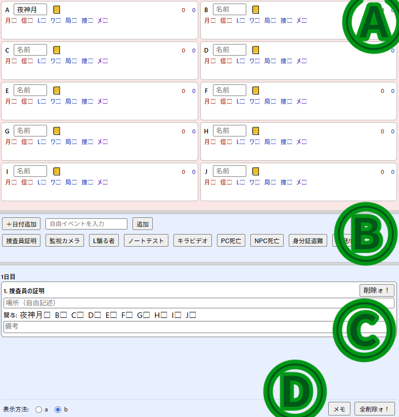
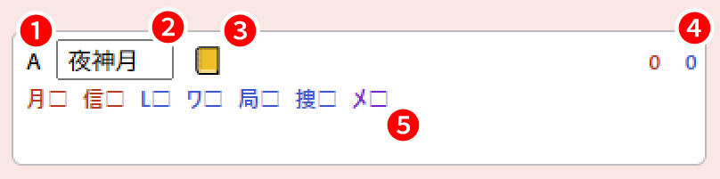
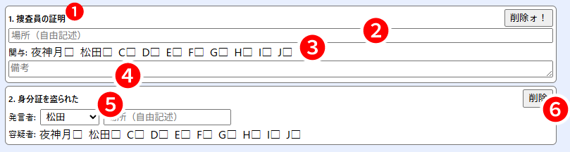
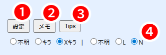
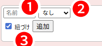

# DEATH NOTE Killer Within用Webメモアプリ（局長メモ）　readme  
  
---  
# 作者  
- 作者（アイコン描きやreadme書きはやったけどコードの全てはGPTに指示を出しただけ）…紅茶即乱（X:[@teasokuran](https://x.com/teasokuran)）  
- 神！…ChatGPT5  
  
---  

  
# 更新履歴  
- V1.0（2025-8-20ぐらい）  
　自分用に作っていたやつ。公開はしてないしデータも残ってない。  
  
- V1.1（2025-8-26）    
 　公開用にV1.1から様々な修正をしたもの。    
  
- V1.2（2025-9-4）    
 　Xキラ、Nへ対応。名前欄を残してイベント欄だけをリセットする機能の追加。   
  
- V1.3（2025-9-26）    
　**ノートテスト・キラビデオのチェック欄を多段にする機能の追加**。Tips欄の追加。陣営選択に不明を追加。**名前の表示モードにb´を追加。**  
 　イベントに合同捜査、逮捕の追加。イベントリセットで名前欄以外全てリセットされるように変更。  
 　キラ/Xキラ等の選択できる陣営の役職欄の片側にチェックを付けていた場合、もう片方に変更してもチェックが引き継がれないバグの修正。Nの固有イベントで青数字が増えていたバグの修正。SPKがSPSになっていた誤字の修正。  
  
- V1.3（2025-11-02）    
　**イベントに"場所"（初期リスポン位置をメモできるイベント。）を追加。**  
  
---  
  
# 禁止事項    
1. **無断での再配布・改変したものの無断で再配布**（AIで作っただけのアプリなので改変して問題が起きた時に責任を全く持てないため）  
但しお金取って再配布はやる人いないと思うけど有断でもダメだからやめてね！！！！！！  
**※2025/9/15　改変・再配布全部ダメから無断ではダメに変更**  
正直よりよくしてくれるなら直す手間がなくなっていいので多分聞かれればいいよって言います。  
  
2. また、このアプリを公式アプリだよ的な紹介をするのを禁止します。  
まあ大体説明するまでもないと思います。このアプリは公式とは一切関係ない非公式アプリです！！！  
  
3. **「メモアプリ入れてないの？」「メモアプリ使えよ」「メモアプリ入れてないとかやる気あるの？」的な言動を人にしないでください。**  
とにかくこのアプリを人に強制したりこのアプリを使ってない＝ガチじゃないと人を責めてギスギスさせるのやめてね。使うも使わないも自由です。  
メモアプリって知ってる？めっちゃ便利なアプリだよ！使ってみたら！？とかなら大歓迎です！！  
  
---  
  
# 使用方法  
  
## 導入方法  
1. ブラウザ版  
[このリンク](https://kirawithinman.github.io/Killer-Within-Memo-App/)から飛べます。  とりあえず試してみたいだけならこちらからどうぞ。  
2. exe版（DL版）  
局長メモ配布用.zipをDLして解凍して使ってください。  
  
  
## ブラウザ版とexe版の違い    
　ブラウザ版は横幅の下限の制限が厳しいので、想定している使い方（27インチのモニタで横幅1600でゲームを起動し、その横にこのアプリを置く）だとちょっと大きくて邪魔になります。  
　exe版だと横幅の下限が割と自由なので、この使い方でも邪魔になりません。  
　**逆にそれ以外の違いは一切ありません。** ちょっと邪魔でも大丈夫な人、サブモニタにアプリを出す人、exeファイル怪しいなって人はブラウザ版で全く問題ありません。  
  
---  
  
## HOW TO USE IT  
  
### 大まかな使い方  
  
  
（Ａ）…プレイヤー欄  
　ここでプレイヤーの名前、役職候補、身分証の有無などを管理します。  
  
（Ｂ）…イベント追加欄  
　ここでイベントを追加します。  
  
（Ｃ）…イベント表示欄  
 　ここに追加されたイベントが時系列順に表示されます。また、イベントの場所や関与者などをここで編集します。  
  
（Ｄ）…設定欄  
　キラ/Xキラ・L/Nの変更、メモ欄・TIPSの表示、詳細設定欄の表示を行います。  
  
---  
  
### プレイヤー欄の使い方  
  
  
  
1. アルファベット  
   ただのA～Jまでのプレイヤー順のアルファベットですが、**ここを押すと時系列が最新のイベントに、その人の関与のチェックマークを付けることが出来ます。** 便利。  
  
2. 名前欄  
   名前をいれてください。イベント欄には頭文字3文字までしか表示されません。  
  
3. 身分証  
   クリックすることで身分証を盗まれた（身分証マークに打ち消し線）表示にすることができます。同時に背景色も灰色に変化して一目でわかりやすい。  
   また、**盗まれた表示に切り替わった時、イベント表示欄の一番下に『身分証を盗まれた』イベントが"発言者：その人"の状態で自動的に作成されます。** 超便利。  
  
4. 数字  
   イベントへの関与具合によって、キラ側の可能性が高い人物は赤、L側の可能性が高い人物は青の数字が増加します。詳細はイベント欄で解説します。  
  
5. 役職
   役職候補、確定した役職にチェックを付けることが出来ます。  
   候補・確定は☑、その役職ではないには×マークを付けます。また、☑の役職によって背景の色が変化します。（キラ側：薄い赤　L側：薄い青　メロ：薄い紫）  
    
---  
    
### イベント追加欄の使い方    
基本的に見ての通りです。身分証盗難・告発/白出し・逮捕は会議時、それ以外は捜査時に追加するのを想定しています。    
日付は自動的に一日目から始まるので、一日目が始まる時に日付追加を押す必要はありません。2日目、3日目に変わった時に押すと2日目・3日目…のラベルが追加されます。  
    
---  
    
### イベント表示欄の使い方    
  
  
  
- 汎用説明  
  
1. ラベル  
   追加したイベントの名前が表示されます。イベントは下側に追加されます。一番下のイベントが一番新しく、一番上のイベントが一番古い。  
  
2. 場所  
   場所を書いてください。自由記述。  
  
3. 関与者/容疑者  
   そのイベントに関与した人物、容疑者の人物にチェックを付けて管理します。  
  
4. 備考欄  
   備考を自由記述。  
  
5. 発言者    
   発言者をプレイヤー欄からプルダウン式で選択します。  また、**身分証盗難イベントでこのプルダウンからプレイヤーが選択された時、そのプレイヤーの身分証マークが自動的に盗難表示になります。** 便利。  
  
6. 削除ォ！    
   間違って追加したイベントを削除ォ！！してください。  
  
- 各イベントの詳細  
   - 捜査員の証明  
     関与（☑）した場合青数字が増加します。（捜査員が裁かれた時以外はあてにならないので、普通に判明した場合は付けない方がよい。）  
     ×は近くに捜査員が湧いたのに触れなかったプレイヤーに付けるとヨシ。大体局長かキラ側かメロ。  
       
   - Lを騙るもの  
     関与（☑）した場合青数字が増加します。（偽物が裁かれた時以外はあてにならないので、裁かれずに終わった場合は付けない方がよい。）  
       
   - ノートテスト  
     〔処〕）（事件を処理したプレイヤーを想定）、〔見〕（見張り役のプレイヤーを想定）の2種のチェックを付けることが出来ます。V1.3でより便利になりました。  
         
   - キラビデオ  
     〔←〕（左側の事件を処理したPC）、〔→〕（右側の事件を処理したPC）、〔見〕（見張り役）の3種のチェックを付けることが出来ます。V1.3でわざわざイベントを3個作る必要がなくなりました。  
       
   - PC死亡  
     死亡者を選ぶプルダウンと、関与者を付ける欄があります。また、**関与者は青数字が増加します**。（"死んだ時にこのプレイヤーが近くにいた"→"ならデスノートを使ってないからこいつは捜査員だ！"という考え方で使ってください。デスノを使っていたプレイヤーがいたとかは備考欄に書く。）  
       
   - NPC死亡  
     関与者を付ける欄があります。また、同じく**関与者は青数字が増加します**。（デスノを使っていたプレイヤーがいたとかは備考欄に書く。）  
       
   - 合同捜査  
     対象者2名をプルダウンで選びます。誰と誰がやってたか忘れてしまう人（俺）のために。  
       
   - 身分証盗難  
     発言者（盗まれた人）のプルダウンと、容疑者のチェック欄があります。容疑者は赤数字が増加します。  
     また、プレイヤー欄で説明したように、**プレイヤー欄の手帳のところを押すとこのイベントが自動で作成されます**。  
       
   - 告発/白出し  
     発言者と内容を選ぶプルダウン、容疑者のチェック欄があります。  
     プルダウンが捜査員の場合、容疑者の関与したPCの青数字が増加します。  
     プルダウンがキラの場合、容疑者の関与したPCの赤数字が増加します。  
       
   - 逮捕  
     容疑者・確保者・結果の3つを選ぶプルダウンがあります。  
     また、結果が身分証盗難による逮捕だった場合、確保者の青数字が増加します。（キラ側orメロが確保者だった場合身分証が出てこないので、**逮捕された人が身分証を落とした場合、逆説的に確保者はL側確定になります**。）  
   - その他イベント（監視カメラ、SPK尾行、ドル札撒き、偽監視タスク、自由追加欄から追加したイベント）  
     場所・関与者・尾行欄のみがあり、青赤数字の増減に関与しない汎用イベントです。  
    
---  
    
### 設定欄の使い方  
  
  
  
1. 詳細設定欄  
   プレイヤー欄と切り替え式で詳細設定欄を開きます。  
  
2. メモ欄  
   プレイヤー欄の上部にメモ欄を開きます。自由に書いてください。  
  
3. Tips欄  
   イベント欄と切り替え式でTips欄を開きます。死んだり拘留されて暇な時にでも読んでください。  
  
4. キラ/L設定欄  
   キラorXキラ、LorNを設定できます。設定と同時にイベント追加欄のイベントも一部変化します。  
   また、キラ/Lがランダム設定の部屋向けに、〔不明〕もあります。不明時のイベントはキラ/Lと同じです。  
  
#### 詳細設定欄の使い方  
  
a. 表示モード  
   プレイヤー欄の表示方法を3形式から選択できます。  
   - A  
     最初は全てがNONE表示で、右下のプレイヤー追加欄からプレイヤーを一人ずつ追加していく形式。   
     参加者が流動的な部屋や、部屋に入ったらすぐ始まっちゃって名前を書く暇がない時に。  
   - B  
     あらかじめ10つの空白のプレイヤーが表示されている形式。名前欄は全員空白。  
     あらかじめプレイヤーを全員記入してから始めるスタイル、参加者の変動のない身内部屋にオススメ。  
   - B´  
     あらかじめ10つの空白のプレイヤーが表示されていて、**名前欄をプルダウンで選ぶ形式**。  
     詳細設定欄に16個の名前記入欄があり、プレイヤー欄でその中からプルダウンで選びます。  
     身内部屋かつ**11人以上の参加者がいて、観戦に回ったりで部屋内でのメンバー変化がある場合**にオススメ。  
       
　　　- パターンAの場合のプレイヤー追加欄の使い方    
　　　    
　　　    
　　　    
　　　　1. 名前欄  
　　　　   名前をいれてください。  
　　　　2. 役職プリセット  
　　　　   デフォルトは無です。プルダウンを"容疑者"に変更するとキラ・キラ信者に、"捜査員"に変更するとL・ワタリ・局長・捜査員に自動的にチェックが入った状態でプレイヤーが追加されます。    
　　　　3. 自動紐づけ  
　　　　   ここにチェックが入っている状態でプレイヤーを追加すると、追加されると同時に**時系列が最新のイベントに、そのプレイヤーの関与のチェックが自動的に付きます。** デフォルトはオンです。    
　　　　   言葉で説明されるより一個イベント作ってからプレイヤー追加した方がわかりやすいと思います。  
  
  
b. イベント欄リセット  
   イベント欄（とプレイヤー欄の身分証欄・役職チェック欄）を全てリセットします。  
   名前だけはそのまま残るので、一試合終わった時に押すボタンという認識で使ってください。  
  
c. 全削除ォ！  
   押すとAll Data all deletionされてアプリ起動時に戻ります。名前欄も含めて本当に全て消えます。    
  
---
